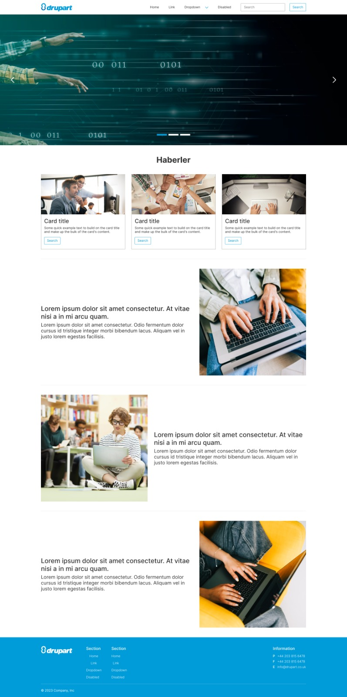

## Drupart Website
--------------------------------
Responsive Website - Example Project

## Description

This project is an example of a responsive website built using HTML, CSS, and Bootstrap. It demonstrates the implementation of a mobile-friendly layout that adapts to different screen sizes and devices.

## Demo
Visit on website => https://drupart-projects.vercel.app/

## Features

- Fully responsive design, ensuring optimal display on various devices, such as desktops, tablets, and smartphones.
- Navigation menu with smooth scrolling functionality for easy navigation within the page.
- Interactive elements, such as buttons and hover effects, to improve user experience.
- Mobile-first approach to ensure a seamless experience on small screens before scaling up.

## Installation

Follow these steps to run the project locally:

1. Clone the repository: https://github.com/hulyakucuk/drupart_projects.git

2. Navigate to the project directory and open the index.html file in your web browser.

## Usage

You can use this project as a starting point for building your own responsive websites. Feel free to modify the HTML, CSS, and Bootstrap components to suit your requirements. Additionally, you can use it as a reference to learn how to create responsive designs.

## Technologies Used

- HTML: Used for the structure and content of the website.
- CSS: Used for styling and layout customization.
- Bootstrap: Used for responsive components.

## License

This project is licensed under the MIT License. See the [LICENSE](LICENSE) file for details.

## Contact

If you have any questions or feedback, feel free to reach out to me at [0hulyakucuk@gmail.com](mailto: 0hulyakucuk@gmail.com).
